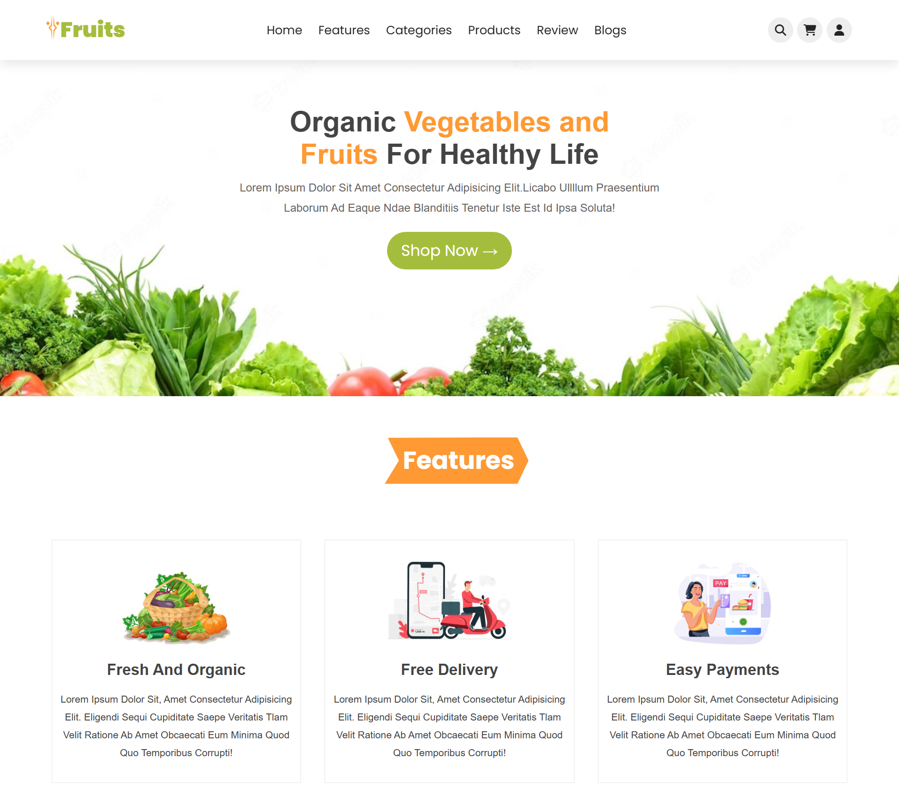
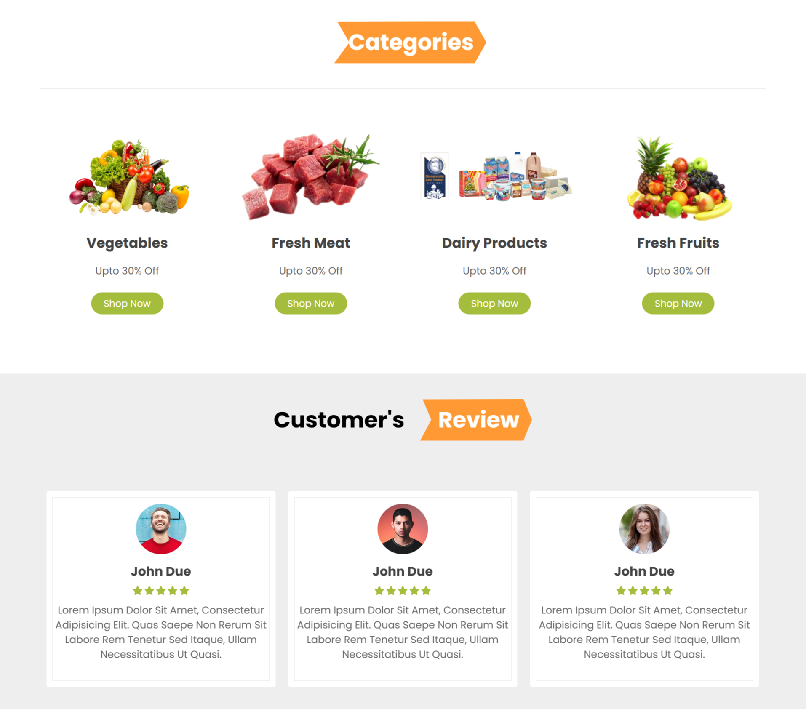

   &nbsp;
  

# Organic Vegetable Website

A fully responsive Organic Vegetable e-commerce website with multiple sections including Home, Features, Categories, Products, Reviews, Blogs, and more. The website also includes user-friendly functionalities like Login/Sign Up, Add to Cart, and Search Bar. Built with HTML, CSS, JavaScript.

## Features
- **Responsive Design**: Works seamlessly on desktop, tablet, and mobile devices.
- **Home Section**: Attractive landing page introducing the website.
- **Features Section**: Highlights key aspects of the business.
- **Categories Section**: Displays product categories for easy navigation.
- **Products Section**: Showcases all available organic vegetables.
- **Reviews Section**: Customer reviews for products.
- **Blogs Section**: Informative blogs about organic farming and health tips.
- **User Authentication**: Login and Sign Up functionality.
- **Shopping Cart**: Add to Cart feature for easy purchasing.
- **Search Bar**: Quickly find products.

## Technologies Used
- HTML5
- CSS3
- CSS Flexbox & Grid
- JavaScript
- Media Query for Responsive Design

## Live Demo
[View Live Website](https://webbyhosna.github.io/organic_veg/)

## Installation
1. Clone the repository:  
   `git clone https://github.com/webbyhosna/organic_veg`
2. Open `index.html` in your browser.

## Author
[Asma Ul Hosna](https://github.com/webbyhosna)
